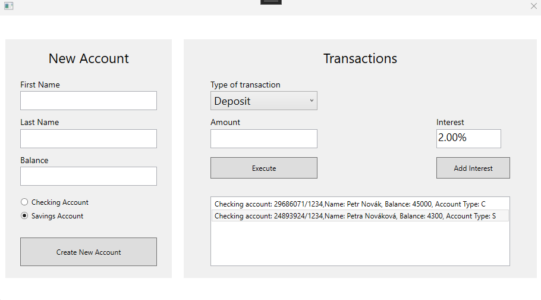

# BankProject

Rekreace maturitního projektu Banka z WinForms do WPF s SQL Disconnected model ADO.NET

Mým cílem bylo se naučit základy WPF a osvěžit si SQL

## Features

- Tvorba "bankovního" účtu zapomocí jména a pozůstatku s generovaným unikátním číslem účtu
- Navýběr ze 2 typů účtů
- Možnost základních operací se všemi vytvořenými účty (Withdraw, Deposit)
- Změny pozůstatku se zapisují a updatují do DB
TODO:
      - operace připisování úroku na `SavingsAccount`, možnost 
      - možnost smazat vytvořený účet
      - implementovat `withdralLimit`

## UI

  
